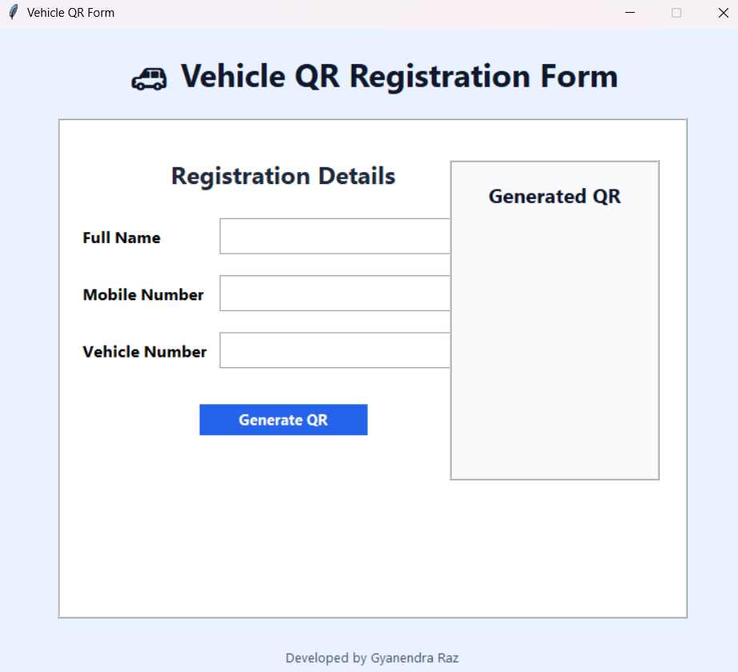

# Vehicle QR Registration System
Vehicle QR Registration System is a Python Tkinter application that generates professional vehicle ID cards with QR codes. Users can enter owner name, mobile number, and vehicle number. The system validates data, creates a QR code, and saves a stylish PNG card for vehicle verification and management.

Python Tkinter project that generates vehicle ID cards with QR codes.

## Project Preview

## Features
- QR Code Generation
- Vehicle ID Card
- Mobile Validation
- Tkinter GUI
- PNG Export
